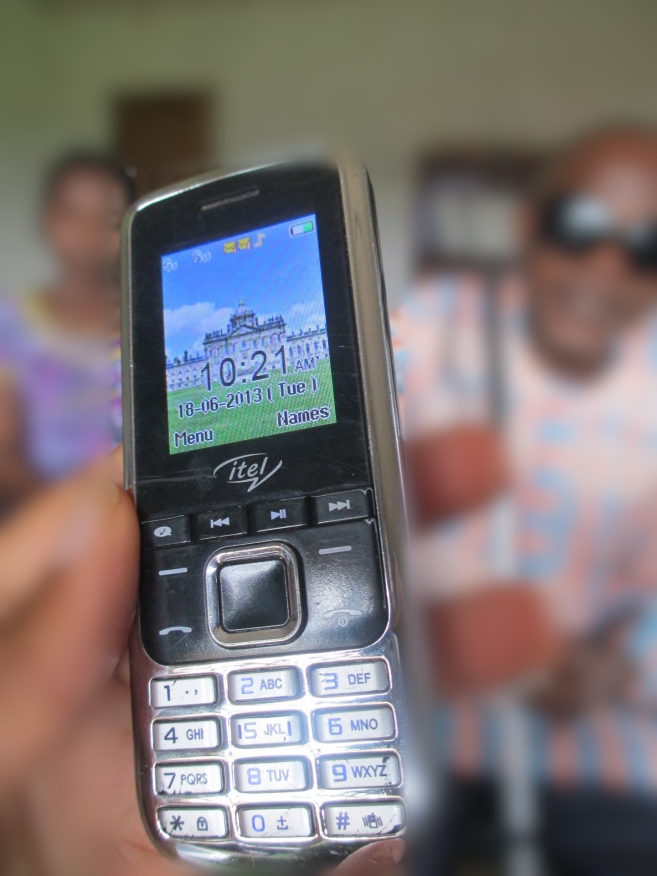

Can digital tools ameliorate the information and communication challenges of managing chronic health conditions, for individuals and their caregivers and supporters? (Collaborative work)

[Can wearables for self-tracking help people maintain their recovery from substance abuse?](https://drive.google.com/file/d/15hHnhC_Ov3IapwLyBKQr0g5Hf-Bhx9r2/view?usp=sharing) (2017-18, ongoing)

[Parents caring for children undergoing bone marrow transplant](https://dl.acm.org/authorize?N42837) (CSCW 2015)

[School Nurses helping families understand and trust community health providers](http://di.ncl.ac.uk/empathy/files/2013/11/Jones_and_Kaziunas.pdf) (2012-13)

